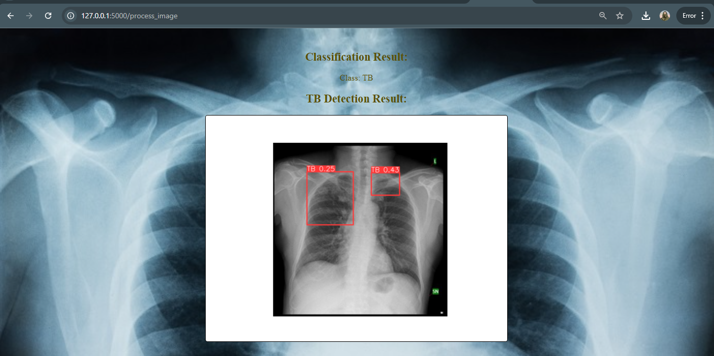

# TB-Classification-and-Detection-using-CNN-and-Yolov5

This project aims to develop an AI-based TB classification and detection solution using deep learning techniques. The system leverages Convolutional Neural Networks (CNNs) for image classification, identifying whether chest X-rays show signs of TB infection. For more advanced localization, YOLOv5 detects specific regions in the X-rays where TB-related abnormalities are present. The combined approach provides both accurate classification and precise detection, enabling automated analysis of medical images to assist in early diagnosis and treatment planning for TB.

## Result

  

